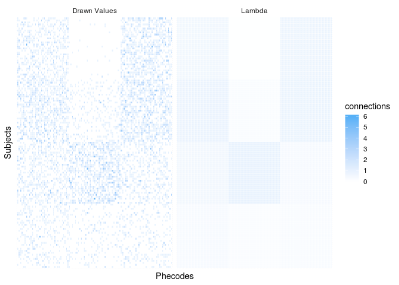

<!-- README.md is generated from README.Rmd. Please edit that file -->

# BiSbmSim

<!-- badges: start -->

<!-- badges: end -->

This package simulates data using the bipartite stochastic block model
(BiSbm).

## Installation

You can install the unrelased version of bisbmsim from github with:

``` r
devtools::install_github('tbilab/bisbmsim')
```

``` r
library(bisbmsim)
library(tidyverse)
library(magrittr)
library(purrr)
```

## Example

Super simple simulation.

First we need to setup basic parameters corresponding to model

``` r
N_a <- 125  # Number of nodes of the a type
N_b <- 105  # Number of nodes of the b type
K_a <- 4    # How many blocks of a type nodes are there
K_b <- 3    # How many blocks of the b type nodes are there
```

In the future these variables will be chosen, not
generated.

``` r
b_a <- assign_group_membership(N = N_a, K = K_a) # Block membership for each a node (automated in future)
b_b <- assign_group_membership(N = N_b, K = K_b) # Block membership for each b node
```

### Average number of connections between each pair of a and b groups

``` r
Lambda <- generate_random_lambda(K_a = K_a, K_b = K_b)
```

Look at what our Lambda looks like real quick.

``` r
ggplot(Lambda, aes(x = a, y = b)) +
  geom_tile(
    aes(fill = avg_num_cons),
    color = 'white'
  ) +
  scale_fill_gradient(low = "white", high = "#56B1F7")
```


## Now we can begin simulation

``` r
all_node_pairs <- draw_from_model(b_a, b_b, Lambda, a_name = "Subjects", b_name = "Phecodes")
all_node_pairs %>% head()
#> # A tibble: 6 x 6
#>   Subjects Phecodes a_group b_group avg_num_cons num_edges
#>      <int>    <int>   <int>   <int>        <dbl>     <int>
#> 1        1        1       1       1        0.333         0
#> 2        2        1       2       1        0.621         0
#> 3        3        1       3       1        0.128         0
#> 4        4        1       4       1        0.328         1
#> 5        5        1       1       1        0.333         0
#> 6        6        1       2       1        0.621         0
```

Plot results and compare with the generating lambda matrix.

``` r
plot_sim_results <- function(drawn_node_pairs){
  drawn_node_pairs %>% 
    mutate(num_edges = ifelse(num_edges >= 1, 1, 0)) %>% 
    gather(key = 'type', value = 'connections', num_edges, avg_num_cons) %>% 
    mutate(type = ifelse(type == 'num_edges', "Drawn Values", "Lambda")) %>% 
    arrange(a_group, b_group) %>% 
    ggplot(aes(x = reorder(Subjects, a_group), y = reorder(Phecodes, b_group))) +
    geom_tile(aes(fill = connections) ) +
    facet_wrap(~type) +
    scale_fill_gradient(low = "white", high = "#56B1F7") + 
    guides(fill = FALSE) +
    labs(x = 'Subjects', y = 'Phecodes') +
    theme_minimal() +
    theme(
      axis.text = element_blank()
    )
}

plot_sim_results(all_node_pairs)
```



# Setting up planted patterns

``` r
my_patterns <- tribble(
  ~b1,  ~b2,  ~b3,  ~b4,  ~size,
    1,    1,    0,    0,     10,
    1,    1,    1,    0,     15,
    0,    0,    0,    1,     13,
    0,    0,    1,    1,     24
)

planted_model_params <- setup_planted_pattern_model(my_patterns, num_noise_nodes = 10)

draw_from_planted <- planted_model_params %$%
  draw_from_model(b_a, b_b, Lambda, a_name = "Subjects", b_name = "Phecodes")

plot_sim_results(draw_from_planted)
```


# Lets actually draw a bunch of samples from this same pattern setup

``` r
num_draws <- 25

all_draws <- 1:num_draws %>% 
  purrr::map_dfr(function(draw_num){
    planted_model_params %$%
      draw_from_model(b_a, b_b, Lambda, a_name = "Subjects", b_name = "Phecodes") %>% 
      mutate(draw = draw_num)
  })

all_draws %>% 
  mutate(num_edges = ifelse(num_edges >= 1, 1, 0)) %>% 
  arrange(a_group, b_group) %>% 
  ggplot(aes(x = reorder(Subjects, a_group), y = reorder(Phecodes, b_group))) +
    geom_tile(aes(fill = num_edges) ) +
    scale_fill_gradient(low = "white", high = "#56B1F7") + 
    guides(fill = FALSE) +
    labs(x = 'Subjects', y = 'Phecodes') +
    facet_wrap(~draw) +
    theme_minimal() +
    theme(axis.text = element_blank())
```


