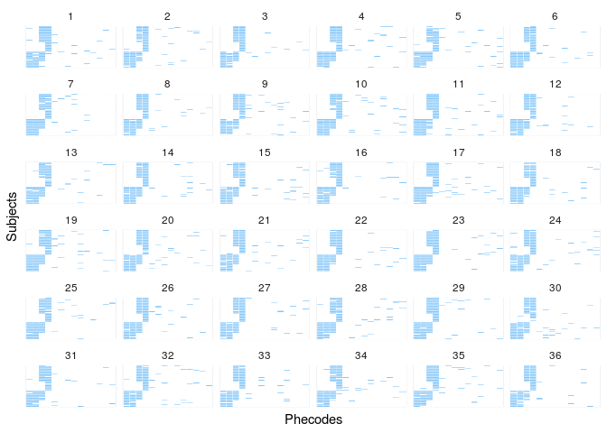

<!-- README.md is generated from README.Rmd. Please edit that file -->

# BiSbmSim

<!-- badges: start -->

<!-- badges: end -->

This package simulates data using the bipartite stochastic block model
(BiSbm).

## Installation

You can install the unrelased version of bisbmsim from github with:

``` r
devtools::install_github('tbilab/bisbmsim')
```

``` r
library(bisbmsim)
library(tidyverse)
library(magrittr)
library(purrr)
```

# Example

Super simple simulation.

First we need to setup basic parameters corresponding to model

``` r
N_a <- 125  # Number of nodes of the a type
N_b <- 105  # Number of nodes of the b type
K_a <- 4    # How many blocks of a type nodes are there
K_b <- 3    # How many blocks of the b type nodes are there
```

## Inputs Needed

The Stochastic Block Model is defined by two main inputs.

### Group Membership Vectors

The group membership vectors are vectors of length `N_a` for a-nodes and
`N_b` for b-nodes. Each element in these vectors is the integer ID of
the group that node belongs to.

`assign_group_membership` is a function that will build these membership
vectors for you when supplied with size and group numbers. By default
they evenly space the groups across the nodes but by using the option
`place_randomly = TRUE` you can also stochastically assign group
membership.

``` r
b_a <- assign_group_membership(N = N_a, K = K_a) # Block membership for each a node (automated in future)
b_b <- assign_group_membership(N = N_b, K = K_b) # Block membership for each b node
```

### The Lambda matrix

The Lambda matrix (or tidy dataframe in this case) tells the model the
*average number of connections between each pair of a and b groups*. In
the case of the standard Poisson SBM this means that if the model is
determining the number of edges between a node in group `i` and a node
in group `j`, it does so by drawing from a Poisson distribution with the
mean (or lambda) value of `Lambda(i,j)`.

``` r
Lambda <- generate_random_lambda(K_a = K_a, K_b = K_b)
```

Here’s what this Lambda looks like.

``` r
ggplot(Lambda, aes(x = a, y = b)) +
  geom_tile(
    aes(fill = avg_num_cons),
    color = 'white'
  ) +
  scale_fill_gradient(low = "white", high = "#56B1F7")
```


The `generate_random_lambda()` function by default builds a lambda
between `K_a` a-type groups and `K_b` b-type groups by drawing from a
random uniform distribution. You can change the model that generates the
values by passing the `random_generator` option a function that takes an
input `n` and returns `n` values.

For instance, here’s a Lambda where the individual values are drawn from
a beta distribution.

``` r
drawn_n_betas <- function(n) {
  rbeta(n, shape1 = 2, shape2 = 2)
}

generate_random_lambda(K_a = K_a, K_b = K_b, random_generator = drawn_n_betas)
#>    a b avg_num_cons
#> 1  1 1   0.56297716
#> 2  2 1   0.28096712
#> 3  3 1   0.95683707
#> 4  4 1   0.46303407
#> 5  1 2   0.56111951
#> 6  2 2   0.64230214
#> 7  3 2   0.05145445
#> 8  4 2   0.39709013
#> 9  1 3   0.24976643
#> 10 2 3   0.84605000
#> 11 3 3   0.67108948
#> 12 4 3   0.51824959
```

## Drawing simulated data from a model

Now that we have defined the two main inputs needed for determining an
SBM, the group membership vectors and the Lambda matrix, we can proceed
to actually drawing from the SBM model.

*Note that we have provided names for the different node types with the
`a_name` and `b_name`
arguments.*

``` r
all_node_pairs <- draw_from_model(b_a, b_b, Lambda, a_name = "Subjects", b_name = "Phecodes")
all_node_pairs %>% head()
#> # A tibble: 6 x 6
#>   Subjects Phecodes a_group b_group avg_num_cons num_edges
#>      <int>    <int>   <int>   <int>        <dbl>     <int>
#> 1        1        1       1       1        0.847         1
#> 2        2        1       2       1        0.414         0
#> 3        3        1       3       1        0.175         0
#> 4        4        1       4       1        0.938         0
#> 5        5        1       1       1        0.847         2
#> 6        6        1       2       1        0.414         0
```

We can compare this now with the true underlying generation parameters….

``` r
plot_sim_results <- function(drawn_node_pairs){
  drawn_node_pairs %>% 
    gather(key = 'type', value = 'connections', num_edges, avg_num_cons) %>% 
    mutate(type = ifelse(type == 'num_edges', "Drawn Values", "Lambda")) %>% 
    arrange(a_group, b_group) %>% 
    ggplot(aes(y = reorder(Subjects, a_group), x = reorder(Phecodes, b_group))) +
    geom_tile(aes(fill = connections), color = "white") +
    facet_wrap(~type) +
    scale_fill_gradient(low = "white", high = "#56B1F7") + 
    theme_minimal() +
    theme(axis.text = element_blank()) +
    labs(y = 'Subjects', x = 'Phecodes') 
}

plot_sim_results(all_node_pairs)
```


### Binary Mode

If only binary connected, not-connected results are desired, there is an
option `binary_connections` in `draw_from_model()` that uses the
bernouli distribution to decide if each edge exists or not, rather than
the standard Poisson.

``` r
draw_from_model(
  b_a = b_a, 
  b_b = b_b, 
  Lambda = Lambda, 
  binary_connections = TRUE,
  a_name = "Subjects", 
  b_name = "Phecodes" 
) %>% 
  plot_sim_results()
```


## Setting up planted patterns

If more control over the model setup is desired, the function
`setup_planted_pattern_model` allows specification of a full model
allowing you to specify patterns of b-nodes that characterize groups of
a-nodes.

``` r
my_patterns <- tribble(
  ~b1,  ~b2,  ~b3,  ~b4,  ~size,
    1,    1,    0,    0,     10,
    1,    1,    1,    0,     15,
    0,    0,    0,    1,     13,
    0,    0,    1,    1,     24
)

planted_model_params <- setup_planted_pattern_model(
  my_patterns, 
  num_noise_nodes = 10,
  noise_p = 0.03,
  planted_p_on = 0.95,
  planted_p_off = 0.01
)
planted_model_params
#> $b_a
#>  [1] 1 1 1 1 1 1 1 1 1 1 2 2 2 2 2 2 2 2 2 2 2 2 2 2 2 3 3 3 3 3 3 3 3 3 3
#> [36] 3 3 3 4 4 4 4 4 4 4 4 4 4 4 4 4 4 4 4 4 4 4 4 4 4 4 4
#> 
#> $b_b
#>  [1] 1 2 3 4 5 5 5 5 5 5 5 5 5 5
#> 
#> $Lambda
#> # A tibble: 20 x 3
#>        a     b avg_num_cons
#>    <int> <int>        <dbl>
#>  1     1     1         0.95
#>  2     2     1         0.95
#>  3     3     1         0.01
#>  4     4     1         0.01
#>  5     1     2         0.95
#>  6     2     2         0.95
#>  7     3     2         0.01
#>  8     4     2         0.01
#>  9     1     3         0.01
#> 10     2     3         0.95
#> 11     3     3         0.01
#> 12     4     3         0.95
#> 13     1     4         0.01
#> 14     2     4         0.01
#> 15     3     4         0.95
#> 16     4     4         0.95
#> 17     1     5         0.03
#> 18     2     5         0.03
#> 19     3     5         0.03
#> 20     4     5         0.03
```

The function returns a list with the three needed inputs for
`draw_from_model()`

``` r
draw_from_planted <- planted_model_params %$%
  draw_from_model(
    b_a, b_b, Lambda, 
    binary_connections = TRUE, 
    a_name = "Subjects", 
    b_name = "Phecodes" )

plot_sim_results(draw_from_planted)
```


## Running lots of simulations

Once you have your SBM inputs setup all you need to do is loop for as
many simulations as you want and call `draw_from_model()` each time to
get new draws.

``` r
num_draws <- 36

all_draws <- 1:num_draws %>% 
  purrr::map_dfr(function(draw_num){
    planted_model_params %$%
      draw_from_model(b_a, b_b, Lambda, binary_connections = TRUE, a_name = "Subjects", b_name = "Phecodes") %>% 
      mutate(draw = draw_num)
  })

all_draws %>% 
  arrange(a_group, b_group) %>% 
  ggplot(aes(y = reorder(Subjects, a_group), x = reorder(Phecodes, b_group))) +
    geom_tile(aes(fill = num_edges), color = "white") +
    scale_fill_gradient(low = "white", high = "#56B1F7") + 
    labs(y = 'Subjects', x = 'Phecodes') +
    guides(fill = FALSE) +
    facet_wrap(~draw) +
    theme_minimal() +
    theme(axis.text = element_blank())
```


